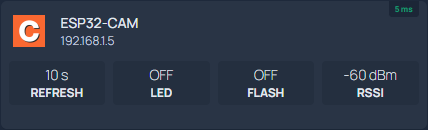
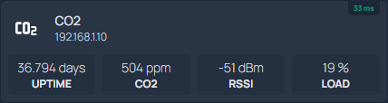

# Homepage service widgets

Snippets for an awesome [Homepage](https://github.com/gethomepage/homepage) dashboard.

Find out more about displaying custom APIs [here](https://gethomepage.dev/latest/widgets/services/customapi/).

## ESP32-Cam

https://github.com/prusa3d/Prusa-Firmware-ESP32-Cam

## ESPEasy

https://github.com/letscontrolit/ESPEasy

## PrusaLink

https://github.com/prusa3d/Prusa-Link-Web

## Tasmota

https://github.com/arendst/Tasmota

